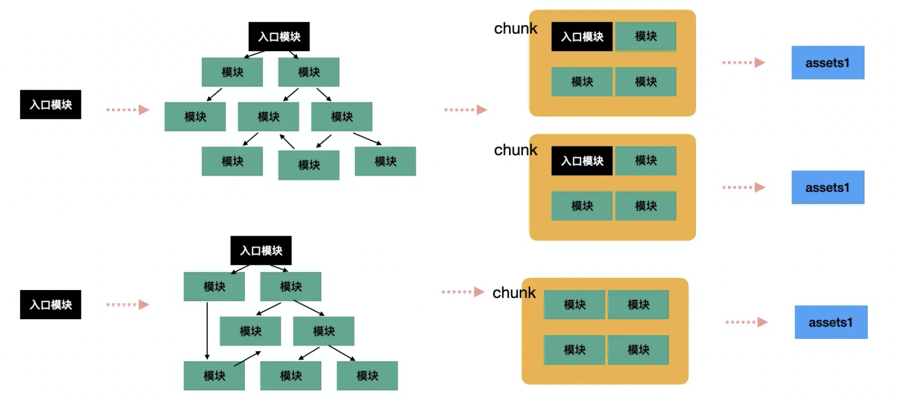

## 生成依赖图


### 需求描述

通过静态分析的方式得出模块间的依赖关系，然后构造成依赖图，之后对这个依赖图做各种处理，最后输出成文件。

比如 webpack 的打包过程：从入口模块分析依赖，构造模块依赖图，然后把一些模块合并到同个分组（chunk）里，生成 chunk 依赖图，最后把 chunk 通过模版打印为 assets，输出为文件。




### 实现思路

模块依赖分析也就是要分析 import 和 export，从入口模块开始，读取文件内容，通过 babel parser 把内容 parse 成 ast，之后通过 babel traverse 来对 AST 进行遍历。分别对 ImportDeclaration、ExportDeclaration 做处理

ImportDeclaration：收集 import 信息，确定依赖的模块和引入的变量，之后再递归处理该模块 ExportDeclaration：收集 export 信息，确定导出的变量


基于以上，可以设计这样一个结构来表示每个模块的信息：

```js
class DependencyNode {
  constructor(path = '', imports = {}, exports = []) {
    this.path = path;
    this.imports = imports;
    this.exports = exports;
    this.subModules = {};
  }
}
```

- path 当前模块路径
- imports：从什么模块引入了什么变量
- exports 表示导出了什么变量
- subModules：子模块


然后就是对每个模块的遍历递归处理：

- 读取文件内容
- 通过 babel parser 把文件内容 parse 成 ast
- 遍历 AST，对 ImportDeclaration、ExportDeclaration 分别做处理
- 对分析出的依赖路径进行处理，变成绝对路径，并尝试补全 .js、.jsx、.ts、.tsx 的路径，如果存在就补全成该路径，并且目录还要补全 index 文件名
- 递归处理分析出来的依赖路径


通过递归处理依赖模块，就可以完成依赖图的构建，可以保存根节点和所有模块的信息：

```js
const dependencyGraph = {
  root: new DependencyNode(),
  allModules: {}
};
```


当处理完所有模块后，就得到了完整的 dependencyGraph。
