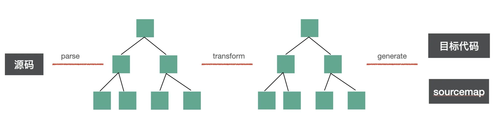
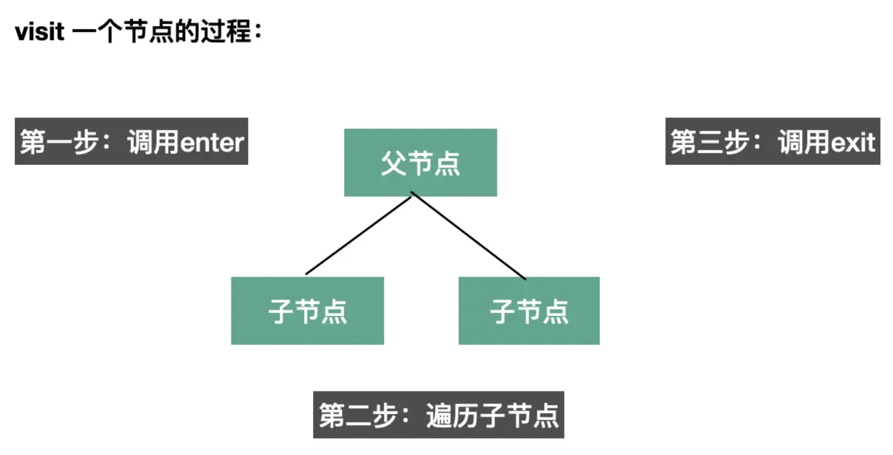
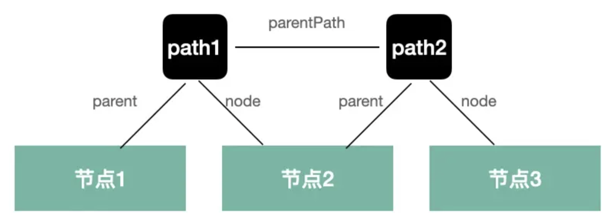
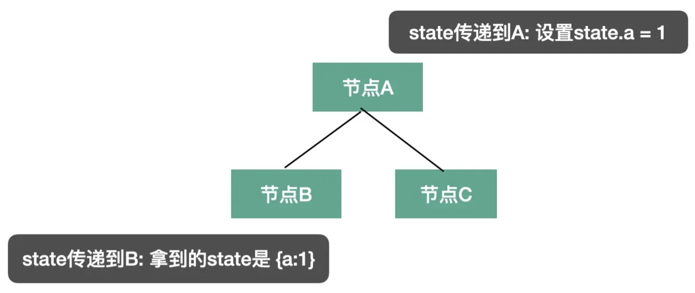

# babel 知识点

babel 是一个转译器，暴露了很多 api，用这些 api 可以完成代码到 AST 的解析、转换、以及目标代码的生成。除此以外，还可以做各种静态分析等。


## babel 的编译流程



整体编译流程如上图，分为三步：

- parse：通过 parser 把源码转成抽象语法树（AST）
- transform：遍历 AST，调用各种 transform 插件对 AST 进行增删改
- generate：把转换后的 AST 打印成目标代码，并生成 sourcemap


## babel 的 AST

babel 编译的第一步是把源码 parse 成抽象语法树 AST （Abstract Syntax Tree），后续对这个 AST 进行转换。

整个编译流程都是围绕 AST 来的，AST 是对源码的抽象，字面量、标识符、表达式、语句、模块语法、class 语法都有各自的 AST。

代码中常见的语法在 babel 的 AST 中对应的节点，比如：标识符 Identifer、各种字面量 xxLiteral、各种语句 xxStatement，各种声明语句 xxDeclaration，各种表达式 xxExpression，以及 Class、Modules、File、Program、Directive、Comment 等 AST 节点。

不同 AST 节点有不同的属性来存放对应的源码信息，但是都有一些公共属性如 type、xxComments、loc 等。

这些 AST 节点信息，可以用 ([astexpoler.net](https://astexplorer.net)) 可视化的查看。


## babel 的 API

babel 将代码解析成了 AST 之后，就需要通过 babel 的 api 来操作 AST，完成代码的转换。

babel 的编译流程分为三步：parse、transform、generate，每一步都暴露了一些 api 出来：

- parse 阶段有 `@babel/parser`，功能是把源码转成 AST。
- transform 阶段有 `@babel/traverse`，可以遍历 AST，并调用 visitor 函数修改 AST，修改 AST 自然涉及到 AST 的判断、创建、修改等，这时候就需要 `@babel/types` 了，当需要批量创建 AST 的时候可以使用 `@babel/template` 来简化 AST 创建逻辑。
- generate 阶段会把 AST 打印为目标代码字符串，同时生成 sourcemap，需要 `@babel/generator` 包。中途遇到错误想打印代码位置的时候，使用 `@babel/code-frame` 包。
- babel 的整体功能通过 `@babel/core` 提供，基于上面的包完成 babel 整体的编译流程，并应用 plugin 和 preset。

其中，最重要的就是 `@babel/parser`，`@babel/traverse`，`@babel/generator`，`@babel/types`，`@babel/template` 这五个包的 api 的使用。对应的文档: [文档](https://www.babeljs.cn/docs/babel-parser)。


### @babel/parser

babel parser 是基于 acorn 实现的，扩展了很多语法，可以支持 es next、jsx、flow、typescript 等语法的解析。

但是 babel 默认只能解析 js 代码，jsx、flow、typescript 这些非标准的语法的解析需要指定语法插件。

babel parser 提供了有两个 api：parse 和 parseExpression。两者都是把源码转成 AST，不过 parse 返回的 AST 根节点是 File（整个 AST），parseExpression 返回的 AST 根节点是 Expression（表达式的 AST），粒度不同。

```typescript
function parse(input: string, options?: ParserOptions): File

function parseExpression(input: string, options?: ParserOptions): Expression
```

详细的 options [文档](https://www.babeljs.cn/docs/babel-parser#options)。主要分为两类：

- 一是：parse 的内容是什么

- 二是：以什么方式去 parse

**parse 的内容是什么**

- `plugins`： 指定jsx、typescript、flow 等插件来解析对应的语法。
- `allowXxx`： 指定一些语法是否允许，比如函数外的 await、没声明的 export 等。
- `sourceType`： 指定是否支持解析模块语法，有 3 个取值：
  - module：解析 es module 语法。
  - script：不解析 es module 语法。
  - unambiguous：根据内容是否有 import 和 export 来自动设置 module 还是 script。

> 通常情况下，sourceType 一般指定为 unambiguous 模式。

**以什么方式去 parse**

- `strictMode`：是否是严格模式
- `startLine`：从源码哪一行开始 parse
- `errorRecovery`：出错时是否记录错误并继续往下 parse
- `tokens`：parse 的时候是否保留 token 信息
- `ranges`：是否在 ast 节点中添加 ranges 属性


### @babel/traverse

parse 出的 AST 由 @babel/traverse 来遍历和修改

```js
function traverse(parent, opts)
```

parent 指定要遍历的 AST 节点，**opts 指定 visitor 函数**。babel 会在遍历 parent 对应的 AST 时调用相应的 visitor 函数。


#### 遍历过程

visitor 是指定对什么 AST 做什么处理的函数，babel 会在遍历到对应的 AST 时回调它们。

而且可以指定刚开始遍历（enter）和遍历结束后（exit）两个阶段的回调函数，如：

```js
traverse(ast, {
  FunctionDeclaration: {
    enter(path, state) {}, // 进入节点时调用
    exit(path, state) {} // 离开节点时调用
  }
})
```

如果只指定了一个函数，那就是 enter 阶段会调用的：

```js
traverse(ast, {
  FunctionDeclaration(path, state) {} // 进入节点时调用
})
```

enter 时调用是在遍历当前节点的子节点前调用，exit 时调用是遍历完当前节点的子节点后调用。流程关系如下：



另外，同一个 visitor 函数可以用于多个 AST 节点的处理，方式是指定一系列 AST，用 | 连接：

```js
// 进入 FunctionDeclaration 和 VariableDeclaration 节点时调用
traverse(ast, {
  'FunctionDeclaration|VariableDeclaration'(path, state) {}
})
```


此外，AST 还有别名，比如各种 XxxStatement 有个 Statement 的别名，各种 XxxDeclaration 有个 Declaration 的别名，那自然可以通过别名来指定对这些 AST 的处理：

```js
// 通过别名指定进入各种 Declaration 节点时调用
traverse(ast, {
  Declaration: {
    enter(path, state) {}
  }
})
```


更多具体的别名可以在 [文档](https://www.babeljs.cn/docs/babel-types#aliases) 或者 [源码](https://github.com/babel/babel/blob/main/packages/babel-types/src/ast-types/generated/index.ts#L2059) 中查。


#### visitor 参数

每个 visitor 都有 path 和 state 的参数


##### path

AST 是树结构，遍历过程中肯定是有路径的，path 就记录了这个路径：



如上图：

- 节点 1、节点 2、节点 3 是三层 AST，通过两个 path 关联了起来
-  path1 就关联了节点 1 和 节点 2，记录了节点 1 是父节点，节点 2 是子节点
- path2 关联了节点 2 和节点 3，记录了节点 2 是父节点，节点 3 是子节点
- path1 和 path2 还有父子关系


此外，path 还有很多属性和方法，如下：

> 1、记录父子、兄弟等关系的：
>
> - path.node 指向当前 AST 节点
> - path.parent 指向父级 AST 节点
> - path.getSibling、path.getNextSibling、path.getPrevSibling 获取兄弟节点
> - path.find 从当前节点向上查找节点
> - path.get、path.set 获取 / 设置属性的 path
>
> 
>
> 与作用域相关的：
>
> - path.scope 获取当前节点的作用域信息
>
> 
>
> 3、判断 AST 类型的：
>
> - path.isXxx 判断当前节点是不是 xx 类型
> - path.assertXxx 判断当前节点是不是 xx 类型，不是则抛出异常
>
> 
>
> 增删改 AST 的：
>
> - path.insertBefore、path.insertAfter 插入节点
> - path.replaceWith、path.replaceWithMultiple、replaceWithSourceString 替换节点
> - path.remove 删除节点
>
> 
>
> 跳过遍历的：
>
> - path.skip 跳过当前节点的子节点的遍历
> - path.stop 结束后续遍历
>
> 
>
> 6、......
>
> 

path 的 api 支持了：增删改 AST，按照路径查找任意的节点，还有作用域的信息，这是分析和转换代码的基石。


##### state

state 则是遍历过程中在不同节点之间传递数据的机制，插件会通过 state 传递 options 和 file 信息，同时也可以通过 state 存储一些遍历过程中的共享数据。

节点之间是有传输数据的需求的，不同状态下可能会做不同的处理。




### @babel/types

遍历 AST 的过程中需要创建一些 AST 和判断 AST 的类型，这时候就需要 `@babel/types` 包。相关[文档](https://babeljs.io/docs/babel-types#api)


比如要创建 IfStatement 就可以调用

```js
t.ifStatement(test, consequent, alternate);
```


判断节点是否是 IfStatement 就可以调用 isIfStatement 或者 assertIfStatement

```js
t.isIfStatement(node, opts);

t.assertIfStatement(node, opts);
```

> isXxx 和 assertXxx 看起来很像，但是功能不大一样：isXxx 会返回 boolean，而 assertXxx 则会在类型不一致时抛异常。


opts 可以指定一些属性是什么值，增加更多限制条件，做更精确的判断。

```js
t.isIdentifier(node, { name: "paths" });
```


### @babel/template

如果通过 @babel/types 创建 AST，会很麻烦的，要一个个的创建然后组装，如果 AST 节点比较多的话需要写很多代码，这时候就可以使用 `@babel/template` 包来批量创建。相关[文档](https://www.babeljs.cn/docs/babel-template#string-usage)


`@babel/template` 常用的一些 api：

```js
import template from "@babel/template";


const ast = template(code, [opts])(args);
const ast = template.ast(code, [opts]);
const ast = template.program(code, [opts]);
const ast = template.expression(code, [opts]);
const ast = template.statements(code, [opts]);
```


使用例子：

```js
const ast = template.ast(`
  var myModule = require("my-module");
`);
```


这些都是传入一段字符串，返回创建好的 AST，区别是返回的 AST 粒度不大一样：

- `template.ast` 返回的是整个 AST。
- `template.program` 返回的是 Program 根节点。
- `template.expression` 返回创建的 expression 的 AST。
- `template.statements` 返回创建的 statems 数组的 AST。


同时，模版也支持占位符，可以在模版里设置一些占位符，调用时再传入这些占位符参数对应的 AST 节点。

比如：

```js
const fn = template(`console.log(NAME)`);

const ast = fn({
  NAME: t.stringLiteral("guang"),
});
```

当占位符与其他变量冲突时，可以加上  %% 用于区分：

```js
const fn = template(`console.log(%%NAME%%)`);

const ast = fn({
  NAME: t.stringLiteral("guang"),
});
```


### @babel/generator

AST 转换完之后就要打印成目标代码字符串，此时可以通过 `@babel/generator` 包的 generate api

```js
function (ast: Object, opts: Object, code: string): {code, map} 
```

- 第一个参数是要打印的 AST。
- 第二个参数是 options，指定打印的一些细节，比如通过 comments 指定是否包含注释，通过 minified 指定是否包含空白字符。具体查看[文档](https://www.babeljs.cn/docs/babel-generator#options)
- 第三个参数当多个文件合并打印的时候需要用到，这部分可以查阅[文档](https://link.juejin.cn/?target=https%3A%2F%2Fbabeljs.io%2Fdocs%2Fen%2Fbabel-generator)，(PS: 基本用不到)。


options 中常用的是 sourceMaps，开启了这个选项才会生成 sourcemap。

```js
import generate from "@babel/generator";

const { code, map } = generate(ast, { sourceMaps: true });
```


### @babel/code-frame

babel 报错的时候，可以使用  `@babel/code-frame` 这个包打印错误信息，可以实现高亮等。

例子：

```js
const { codeFrameColumns } = require("@babel/code-frame");

try {
 throw new Error("xxx 错误");
} catch (err) {
  console.error(codeFrameColumns(`const name = guang`, {
      start: { line: 1, column: 14 }
  }, {
    highlightCode: true, // 是否高亮
    message: err.message // 展示的错误信息
  }));
}
```


### @babel/core

这是 babel 的核心，完成整个编译流程，从源码到目标代码，生成 sourcemap。实现 plugin 和 preset 的调用。相关[文档](https://www.babeljs.cn/docs/babel-core)


比如一些常用的 api

```js
transformSync(code, options); // => { code, map, ast }

transformFileSync(filename, options); // => { code, map, ast }

transformFromAstSync(
  parsedAst,
  sourceCode,
  options
); // => { code, map, ast }
```

这三个 transformXxx 的 api 分别是从源代码、源代码文件、源代码 AST 开始处理，最终生成目标代码和 sourcemap。

options 主要配置 plugins 和 presets，指定具体要做什么转换。