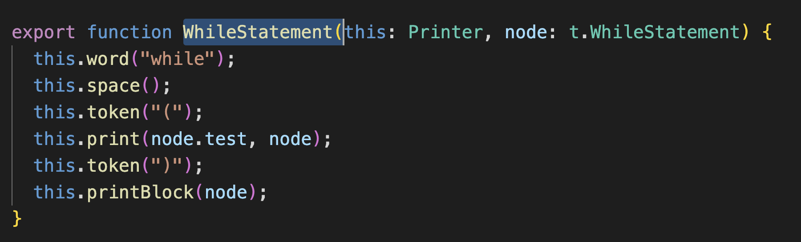

# babel 知识点

babel 是一个转译器，暴露了很多 api，用这些 api 可以完成代码到 AST 的解析、转换、以及目标代码的生成。除此以外，还可以做各种静态分析等。


## babel 的编译流程


整体编译流程如上图，分为三步：

- parse：通过 parser 把源码转成抽象语法树（AST）
- transform：遍历 AST，调用各种 transform 插件对 AST 进行增删改
- generate：把转换后的 AST 打印成目标代码，并生成 sourcemap


## babel 的 AST

babel 编译的第一步是把源码 parse 成抽象语法树 AST （Abstract Syntax Tree），后续对这个 AST 进行转换。

整个编译流程都是围绕 AST 来的，AST 是对源码的抽象，字面量、标识符、表达式、语句、模块语法、class 语法都有各自的 AST。

代码中常见的语法在 babel 的 AST 中对应的节点，比如：标识符 Identifer、各种字面量 xxLiteral、各种语句 xxStatement，各种声明语句 xxDeclaration，各种表达式 xxExpression，以及 Class、Modules、File、Program、Directive、Comment 等 AST 节点。

不同 AST 节点有不同的属性来存放对应的源码信息，但是都有一些公共属性如 type、xxComments、loc 等。

这些 AST 节点信息，可以用 ([astexpoler.net](https://astexplorer.net)) 可视化的查看。


## babel 的 API

babel 将代码解析成了 AST 之后，就需要通过 babel 的 api 来操作 AST，完成代码的转换。

babel 的编译流程分为三步：parse、transform、generate，每一步都暴露了一些 api 出来：

- parse 阶段有 `@babel/parser`，功能是把源码转成 AST。
- transform 阶段有 `@babel/traverse`，可以遍历 AST，并调用 visitor 函数修改 AST，修改 AST 自然涉及到 AST 的判断、创建、修改等，这时候就需要 `@babel/types` 了，当需要批量创建 AST 的时候可以使用 `@babel/template` 来简化 AST 创建逻辑。
- generate 阶段会把 AST 打印为目标代码字符串，同时生成 sourcemap，需要 `@babel/generator` 包。中途遇到错误想打印代码位置的时候，使用 `@babel/code-frame` 包。
- babel 的整体功能通过 `@babel/core` 提供，基于上面的包完成 babel 整体的编译流程，并应用 plugin 和 preset。

其中，最重要的就是 `@babel/parser`，`@babel/traverse`，`@babel/generator`，`@babel/types`，`@babel/template` 这五个包的 api 的使用。对应的文档: [文档](https://www.babeljs.cn/docs/babel-parser)。


### @babel/parser

babel parser 是基于 acorn 实现的，扩展了很多语法，可以支持 es next、jsx、flow、typescript 等语法的解析。

但是 babel 默认只能解析 js 代码，jsx、flow、typescript 这些非标准的语法的解析需要指定语法插件。

babel parser 提供了有两个 api：parse 和 parseExpression。两者都是把源码转成 AST，不过 parse 返回的 AST 根节点是 File（整个 AST），parseExpression 返回的 AST 根节点是 Expression（表达式的 AST），粒度不同。

```typescript
function parse(input: string, options?: ParserOptions): File

function parseExpression(input: string, options?: ParserOptions): Expression
```

详细的 options [文档](https://www.babeljs.cn/docs/babel-parser#options)。主要分为两类：

- 一是：parse 的内容是什么

- 二是：以什么方式去 parse

**parse 的内容是什么**

- `plugins`： 指定jsx、typescript、flow 等插件来解析对应的语法。
- `allowXxx`： 指定一些语法是否允许，比如函数外的 await、没声明的 export 等。
- `sourceType`： 指定是否支持解析模块语法，有 3 个取值：
  - module：解析 es module 语法。
  - script：不解析 es module 语法。
  - unambiguous：根据内容是否有 import 和 export 来自动设置 module 还是 script。

> 通常情况下，sourceType 一般指定为 unambiguous 模式。

**以什么方式去 parse**

- `strictMode`：是否是严格模式
- `startLine`：从源码哪一行开始 parse
- `errorRecovery`：出错时是否记录错误并继续往下 parse
- `tokens`：parse 的时候是否保留 token 信息
- `ranges`：是否在 ast 节点中添加 ranges 属性


### @babel/traverse

parse 出的 AST 由 @babel/traverse 来遍历和修改

```js
function traverse(parent, opts)
```

parent 指定要遍历的 AST 节点，**opts 指定 visitor 函数**。babel 会在遍历 parent 对应的 AST 时调用相应的 visitor 函数。


#### 遍历过程

visitor 是指定对什么 AST 做什么处理的函数，babel 会在遍历到对应的 AST 时回调它们。

而且可以指定刚开始遍历（enter）和遍历结束后（exit）两个阶段的回调函数，如：

```js
traverse(ast, {
  FunctionDeclaration: {
    enter(path, state) {}, // 进入节点时调用
    exit(path, state) {} // 离开节点时调用
  }
})
```

如果只指定了一个函数，那就是 enter 阶段会调用的：

```js
traverse(ast, {
  FunctionDeclaration(path, state) {} // 进入节点时调用
})
```

enter 时调用是在遍历当前节点的子节点前调用，exit 时调用是遍历完当前节点的子节点后调用。流程关系如下：


另外，同一个 visitor 函数可以用于多个 AST 节点的处理，方式是指定一系列 AST，用 | 连接：

```js
// 进入 FunctionDeclaration 和 VariableDeclaration 节点时调用
traverse(ast, {
  'FunctionDeclaration|VariableDeclaration'(path, state) {}
})
```


此外，AST 还有别名，比如各种 XxxStatement 有个 Statement 的别名，各种 XxxDeclaration 有个 Declaration 的别名，那自然可以通过别名来指定对这些 AST 的处理：

```js
// 通过别名指定进入各种 Declaration 节点时调用
traverse(ast, {
  Declaration: {
    enter(path, state) {}
  }
})
```


更多具体的别名可以在 [文档](https://www.babeljs.cn/docs/babel-types#aliases) 或者 [源码](https://github.com/babel/babel/blob/main/packages/babel-types/src/ast-types/generated/index.ts#L2059) 中查。


#### visitor 参数

每个 visitor 都有 path 和 state 的参数


##### path

AST 是树结构，遍历过程中肯定是有路径的，path 就记录了这个路径：


如上图：

- 节点 1、节点 2、节点 3 是三层 AST，通过两个 path 关联了起来
-  path1 就关联了节点 1 和 节点 2，记录了节点 1 是父节点，节点 2 是子节点
- path2 关联了节点 2 和节点 3，记录了节点 2 是父节点，节点 3 是子节点
- path1 和 path2 还有父子关系


此外，path 还有很多属性和方法，如下：

> 1、记录父子、兄弟等关系的：
>
> - path.node 指向当前 AST 节点
> - path.parent 指向父级 AST 节点
> - path.getSibling、path.getNextSibling、path.getPrevSibling 获取兄弟节点
> - path.find 从当前节点向上查找节点
> - path.get、path.set 获取 / 设置属性的 path
>
> 
>
> 与作用域相关的：
>
> - path.scope 获取当前节点的作用域信息
>
> 
>
> 3、判断 AST 类型的：
>
> - path.isXxx 判断当前节点是不是 xx 类型
> - path.assertXxx 判断当前节点是不是 xx 类型，不是则抛出异常
>
> 
>
> 增删改 AST 的：
>
> - path.insertBefore、path.insertAfter 插入节点
> - path.replaceWith、path.replaceWithMultiple、replaceWithSourceString 替换节点
> - path.remove 删除节点
>
> 
>
> 跳过遍历的：
>
> - path.skip 跳过当前节点的子节点的遍历
> - path.stop 结束后续遍历
>
> 
>
> 6、......
>
> 

path 的 api 支持了：增删改 AST，按照路径查找任意的节点，还有作用域的信息，这是分析和转换代码的基石。


##### state

state 则是遍历过程中在不同节点之间传递数据的机制，插件会通过 state 传递 options 和 file 信息，同时也可以通过 state 存储一些遍历过程中的共享数据。

节点之间是有传输数据的需求的，不同状态下可能会做不同的处理。


### @babel/types

遍历 AST 的过程中需要创建一些 AST 和判断 AST 的类型，这时候就需要 `@babel/types` 包。相关[文档](https://babeljs.io/docs/babel-types#api)


比如要创建 IfStatement 就可以调用

```js
t.ifStatement(test, consequent, alternate);
```


判断节点是否是 IfStatement 就可以调用 isIfStatement 或者 assertIfStatement

```js
t.isIfStatement(node, opts);

t.assertIfStatement(node, opts);
```

> isXxx 和 assertXxx 看起来很像，但是功能不大一样：isXxx 会返回 boolean，而 assertXxx 则会在类型不一致时抛异常。


opts 可以指定一些属性是什么值，增加更多限制条件，做更精确的判断。

```js
t.isIdentifier(node, { name: "paths" });
```


### @babel/template

如果通过 @babel/types 创建 AST，会很麻烦的，要一个个的创建然后组装，如果 AST 节点比较多的话需要写很多代码，这时候就可以使用 `@babel/template` 包来批量创建。相关[文档](https://www.babeljs.cn/docs/babel-template#string-usage)


`@babel/template` 常用的一些 api：

```js
import template from "@babel/template";


const ast = template(code, [opts])(args);
const ast = template.ast(code, [opts]);
const ast = template.program(code, [opts]);
const ast = template.expression(code, [opts]);
const ast = template.statements(code, [opts]);
```


使用例子：

```js
const ast = template.ast(`
  var myModule = require("my-module");
`);
```


这些都是传入一段字符串，返回创建好的 AST，区别是返回的 AST 粒度不大一样：

- `template.ast` 返回的是整个 AST。
- `template.program` 返回的是 Program 根节点。
- `template.expression` 返回创建的 expression 的 AST。
- `template.statements` 返回创建的 statems 数组的 AST。


同时，模版也支持占位符，可以在模版里设置一些占位符，调用时再传入这些占位符参数对应的 AST 节点。

比如：

```js
const fn = template(`console.log(NAME)`);

const ast = fn({
  NAME: t.stringLiteral("guang"),
});
```

当占位符与其他变量冲突时，可以加上  %% 用于区分：

```js
const fn = template(`console.log(%%NAME%%)`);

const ast = fn({
  NAME: t.stringLiteral("guang"),
});
```


### @babel/generator

AST 转换完之后就要打印成目标代码字符串，此时可以通过 `@babel/generator` 包的 generate api

```js
function (ast: Object, opts: Object, code: string): {code, map} 
```

- 第一个参数是要打印的 AST。
- 第二个参数是 options，指定打印的一些细节，比如通过 comments 指定是否包含注释，通过 minified 指定是否包含空白字符。具体查看[文档](https://www.babeljs.cn/docs/babel-generator#options)
- 第三个参数当多个文件合并打印的时候需要用到，这部分可以查阅[文档](https://link.juejin.cn/?target=https%3A%2F%2Fbabeljs.io%2Fdocs%2Fen%2Fbabel-generator)，(PS: 基本用不到)。


options 中常用的是 sourceMaps，开启了这个选项才会生成 sourcemap。

```js
import generate from "@babel/generator";

const { code, map } = generate(ast, { sourceMaps: true });
```


### @babel/code-frame

babel 报错的时候，可以使用  `@babel/code-frame` 这个包打印错误信息，可以实现高亮等。

例子：

```js
const { codeFrameColumns } = require("@babel/code-frame");

try {
 throw new Error("xxx 错误");
} catch (err) {
  console.error(codeFrameColumns(`const name = guang`, {
      start: { line: 1, column: 14 }
  }, {
    highlightCode: true, // 是否高亮
    message: err.message // 展示的错误信息
  }));
}
```


### @babel/core

这是 babel 的核心，完成整个编译流程，从源码到目标代码，生成 sourcemap。实现 plugin 和 preset 的调用。相关[文档](https://www.babeljs.cn/docs/babel-core)


比如一些常用的 api

```js
transformSync(code, options); // => { code, map, ast }

transformFileSync(filename, options); // => { code, map, ast }

transformFromAstSync(
  parsedAst,
  sourceCode,
  options
); // => { code, map, ast }
```

这三个 transformXxx 的 api 分别是从源代码、源代码文件、源代码 AST 开始处理，最终生成目标代码和 sourcemap。

options 主要配置 plugins 和 presets，指定具体要做什么转换。


## traverse 的 path、scope、visitor

源码 parse 成 AST 之后，babel 会递归遍历 AST，遍历过程中处理到不同的 AST 会调用不同的 visitor 函数来实现 transform。这其实是一种设计模式，叫做访问者模式。

访问者模式：当被操作的对象结构比较稳定，而操作对象的逻辑经常变化的时候，通过分离逻辑和对象结构，使得他们能独立扩展。

对于 babel 而言，ast 就是相对固定的结构，visitor 逻辑操作是根据场景变化的。


### path 和 path.scope


#### path

path 的一些属性和方法如下：

```js
path {
  // -------------------------- 属性 ----------------------------
  node 
  parent
  parentPath
  scope
  hub
  container
  key
  listKey

  // --------------------------- 方法 ----------------------------
  get(key) 
  set(key, node)
  inList()
  getSibling(key) 
  getNextSibling()
  getPrevSibling()
  getAllPrevSiblings()
  getAllNextSiblings()
  isXxx(opts)
  assertXxx(opts)
  find(callback)
  findParent(callback)

  insertBefore(nodes)
  insertAfter(nodes)
  replaceWith(replacement)
  replaceWithMultiple(nodes)
  replaceWithSourceString(replacement)
  remove()

  traverse(visitor, state)
  skip()
  stop()
}
```

path 几个属性的含义：

- `path.node` 当前 AST 节点
- `path.parent` 父 AST 节点
- `path.parentPath` 父 AST 节点的 path
- `path.scope` 作用域
- `path.hub` 可以通过 path.hub.file 拿到最外层 File 对象， path.hub.getScope 拿到最外层作用域，path.hub.getCode 拿到源码字符串
- `path.container` 当前 AST 节点所在的父节点属性的属性值
- `path.key` 当前 AST 节点所在父节点属性的属性名或所在数组的下标
- `path.listkey` 当前 AST 节点所在父节点属性的属性值为数组时 listkey 为该属性名，否则为 undefined


path 几个方法的含义：

- get(key) 获取某个属性的 path
- set(key, node) 设置某个属性的值
- getSibling(key) 获取某个下标的兄弟节点
- getNextSibling() 获取下一个兄弟节点
- getPrevSibling() 获取上一个兄弟节点
- getAllPrevSiblings() 获取之前的所有兄弟节点
- getAllNextSiblings() 获取之后的所有兄弟节点
- find(callback) 从当前节点到根节点来查找节点（包括当前节点），调用 callback（传入 path）来决定是否终止查找
- findParent(callback) 从当前节点到根节点来查找节点（不包括当前节点），调用 callback（传入 path）来决定是否终止查找
- inList() 判断节点是否在数组中，如果 container 为数组，也就是有 listkey 的时候，返回 true
- isXxx(opts) 判断当前节点是否是某个类型，可以传入属性和属性值进一步判断，比如path.isIdentifier({name: 'a'})
- assertXxx(opts) 同 isXxx，但是不返回布尔值，而是抛出异常
- insertBefore(nodes) 在之前插入节点，可以是单个节点或者节点数组
- insertAfter(nodes) 在之后插入节点，可以是单个节点或者节点数组
- replaceWith(replacement) 用某个节点替换当前节点
- replaceWithMultiple(nodes) 用多个节点替换当前节点
- replaceWithSourceString(replacement) 解析源码成 AST，然后替换当前节点
- remove() 删除当前节点
- traverse(visitor, state) 遍历当前节点的子节点，传入 visitor 和 state（state 是不同节点间传递数据的方式）
- skip() 跳过当前节点的子节点的遍历
- stop() 结束所有遍历


#### 作用域 path.scope

scope 是作用域信息，javascript 中能生成作用域的就是模块、函数、块等，而且作用域之间会形成嵌套关系，也就是作用域链。babel 在遍历的过程中会生成作用域链保存在 path.scope 中。


`path.scope` 的属性和方法

```js
path.scope {
  // -------------------------- 属性 ----------------------------
  bindings
  block
  parent
  parentBlock
  path
  references

  // --------------------------- 方法 ----------------------------
  dump()
  getAllBindings()
  getBinding(name)
  hasBinding(name)
  getOwnBinding(name)
  parentHasBinding(name)
  removeBinding(name)
  moveBindingTo(name, scope)
  generateUid(name)
}
```

对应的含义：

- scope.bindings 当前作用域内声明的所有变量
- scope.block 生成作用域的 block
- scope.path 生成作用域的节点对应的 path
- scope.references 所有 binding 的引用对应的 path
- scope.dump() 打印作用域链的所有 binding 到控制台
- scope.parentBlock 父级作用域的 block
- getAllBindings() 从当前作用域到根作用域的所有 binding 的合并
- getBinding(name) 查找某个 binding，从当前作用域一直查找到根作用域
- getOwnBinding(name) 从当前作用域查找 binding
- parentHasBinding(name, noGlobals) 查找某个 binding，从父作用域查到根作用域，不包括当前作用域。可以通过 noGlobals 参数指定是否算上全局变量（比如console，不需要声明就可用），默认是 false
- removeBinding(name) 删除某个 binding
- hasBinding(name, noGlobals) 从当前作用域查找 binding，可以指定是否算上全局变量，默认是 false
- moveBindingTo(name, scope) 把当前作用域中的某个 binding 移动到其他作用域
- generateUid(name) 生成作用域内唯一的名字，根据 name 添加下划线，比如 name 为 a，会尝试生成 _a，如果被占用就会生成 __a，直到生成没有被使用的名字。


##### scope.bindings、scope.references（重点）

作用域中保存的是声明的变量和对应的值，**每一个声明叫做一个binding**。


比如下面代码：

```js
const a = 1;
```

它的 path.scope.bindings :

```js
bindings: {
  a: {
    constant: true,
    constantViolations: [],
    identifier: {type: 'Identifier', ...}
    kind:'const',
    path: {node,...}
    referenced: false
    referencePaths: [],
    references: 0,
    scope: ...
  }
}
```


scope 中声明了 a 这个变量，所以 bindings 中有 a 的 binding，每一个 binding 都有 kind，这代表绑定的类型：

- var、let、const 分别代表 var、let、const 形式声明的变量
- param 代表参数的声明
- module 代表 import 的变量的声明

binding 有多种 kind，代表变量是用不同的方式声明的。

binding.identifier 和 binding.path，分别代表标识符、整个声明语句。

声明之后的变量会被引用和修改，binding.referenced 代表声明的变量是否被引用，binding.constant 代表变量是否被修改过。如果被引用了，就可以通过 binding.referencePaths 拿到所有引用的语句的 path。如果被修改了，可以通过 binding.constViolations 拿到所有修改的语句的 path。


### state

state 是遍历过程中 AST 节点之间传递数据的方式。插件的 visitor 中，第一个参数是 path，第二个参数就是 state。

插件可以从 state 中拿到 opts，也就是插件的配置项，也可以拿到 file 对象，file 中有一些文件级别的信息，这个也可以从 path.hub.file 中拿。

```markdown
state {
  file
  opts
}
```

可以在遍历的过程中在 state 中存一些状态信息，用于后续的 AST 处理。


## generator 和 sourcemap

AST 转换完之后就到了 generate 阶段，这个阶段负责将 ast 重新转换为代码，并生成 sourcemap 映射关系


### generate

generate 是把 ast 打印成字符串，是一个从根节点递归打印的过程，对不同的 ast 节点做不同的处理，在这个过程中把抽象语法树中省略掉的一些分隔符重新加回来。

比如 while 循环语句，WhileStatement 就是先打印 while，然后打印一个空格和 '('，然后打印 node.test 属性的节点，然后打印 ')'，之后打印 block 部分

[源码位置](https://github.com/babel/babel/blob/main/packages/babel-generator/src/generators/statements.ts#L96)



通过这样的方式递归打印整个 AST，就可以生成目标代码。@babel/generator 的 [src/generators](https://link.juejin.cn/?target=https%3A%2F%2Fgithub.com%2Fbabel%2Fbabel%2Ftree%2Fmain%2Fpackages%2Fbabel-generator%2Fsrc%2Fgenerators) 下定义了每一种AST节点的打印方式


### sourcemap

babel 对源码进行了修改，生成的目标代码可能改动很大，如果直接调试目标代码，那么可能很难对应到源码里。所以需要一种自动关联源码的方式，就是 sourcemap。


#### sourcemap 的应用

平时用 sourcemap 主要用两个目的：


**1、调试代码时定位到源码**

chrome、firefox 等浏览器支持在文件末尾加上[一行注释](https://link.juejin.cn/?target=https%3A%2F%2Fdeveloper.mozilla.org%2Fzh-CN%2Fdocs%2FTools%2FDebugger%2FHow_to%2FUse_a_source_map)

```js
//# sourceMappingURL=http://example.com/path/to/your/sourcemap.map
```

可以通过 url 的方式或者转成 base64 内联的方式来关联 sourcemap。调试工具（浏览器、vscode 等会自动解析 sourcemap，关联到源码。这样打断点、错误堆栈等都会对应到相应源码。


**2、线上报错定位到源码**

开发时会使用 sourcemap 来调试，但是生产不会， 不能将 sourcemap 上传到生产。但是线上报错的时候确实也需要定位到源码，这种情况一般都是单独上传 sourcemap 到错误收集平台。

比如 sentry 就提供了一个 [@sentry/webpack-plugin](https://link.juejin.cn/?target=https%3A%2F%2Fwww.npmjs.com%2Fpackage%2F@sentry%2Fwebpack-plugin) 支持在打包完成后把 sourcemap 自动上传到 sentry 后台，然后把本地 sourcemap 删掉。还提供了 [@sentry/cli](https://link.juejin.cn/?target=https%3A%2F%2Fwww.npmjs.com%2Fpackage%2F@sentry%2Fcli) 让用户可以手动上传。


#### sourcemap 的格式

```js
{
  version: 3,
  file: 'min.js',
  sourceRoot: 'http://example.com/www/js/',
  sources: ['one.js', 'two.js'],
  names: ['bar', 'baz', 'n'],
  mappings: 'CAAC,GAClB,OAAOC;SAAUE,GAClB,OAAOA'
}
```

这就是 sourcemap 的基本格式，对应字段的含义如下：

- version：source map的版本，目前为3。
- file：转换后的文件名。
- sourceRoot：转换前的文件所在的目录。如果与转换前的文件在同一目录，该项为空。
- sources：转换前的文件。该项是一个数组，因为可能是多个源文件合并成一个目标文件。
- names：转换前的所有变量名和属性名，把所有变量名提取出来，下面的 mapping 直接使用下标引用，可以减少体积。
- mappings：转换前代码和转换后代码的映射关系的集合，用分号代表一行，每行的 mapping 用逗号分隔。


一个 mappings 类似

```js
mappings:"AAAAA,BBBBB;;;;CCCCC,DDDDD"
```

每一个分号 `;` 表示一行，多个空行就是多个 `;`，mapping 通过 `,` 分割。


每一组 mappings 有 5 位，每一位是通过 VLQ 编码的，一个字符就能表示行列数

>  第一位是目标代码中的列数
>  第二位是源码所在的文件名
>  第三位是源码对应的行数
>  第四位是源码对应的列数
>  第五位是源码对应的 names，不一定有

sourcemap 通过 `names` 和 `;` 的设计省略掉了一些变量名和行数所占的空间，又通过 VLQ 编码使得一个字符就可以表示行列数等信息。通过不大的空间占用完成了源码到目标代码的映射。


#### source-map 包

babel 具体生成 sourcemap 的过程是用 mozilla 维护的 [source-map](https://link.juejin.cn/?target=https%3A%2F%2Fwww.npmjs.com%2Fpackage%2Fsource-map) 这个包，其他工具做 sourcemap 的解析和生成也是基于这个包。


source-map 暴露了 SourceMapConsumer、SourceMapGenerator、SourceNode 3个类，分别用于消费 sourcemap、生成 sourcemap、创建源码节点。


##### 生成 sourcemap

生成 sourcemap 的流程是：

1. 创建一个 SourceMapGenerator 对象
2. 通过 addMapping 方法添加一个映射
3. 通过 toString 转为 sourcemap 字符串

```js
var map = new SourceMapGenerator({
  file: "source-mapped.js"
});

map.addMapping({
  generated: {
    line: 10,
    column: 35
  },
  source: "foo.js",
  original: {
    line: 33,
    column: 2
  },
  name: "christopher"
});

console.log(map.toString());
// '{"version":3,"file":"source-mapped.js",
//   "sources":["foo.js"],"names":["christopher"],"mappings":";;;;;;;;;mCAgCEA"}'

```


##### 消费 sourcemap

SourceMapConsumer.with 的回调里面可以拿到 consumer 的 api，调用 originalPositionFor 和 generatedPositionFor 可以分别用目标代码位置查源码位置和用源码位置查目标代码位置。还可以通过 eachMapping 遍历所有 mapping，对每个进行处理。

```js
const rawSourceMap = {
  version: 3,
  file: "min.js",
  names: ["bar", "baz", "n"],
  sources: ["one.js", "two.js"],
  sourceRoot: "http://example.com/www/js/",
  mappings: "CAAC,IAAI,IAAM,SAAUA,GAClB,OAAOC,IAAID;CCDb,IAAI,IAAM,SAAUE,GAClB,OAAOA"
};

const whatever = await SourceMapConsumer.with(rawSourceMap, null, consumer => {
   // 目标代码位置查询源码位置
  consumer.originalPositionFor({
    line: 2,
    column: 28
  })
  // { source: 'http://example.com/www/js/two.js',
  //   line: 2,
  //   column: 10,
  //   name: 'n' }
  
  // 源码位置查询目标代码位置
  consumer.generatedPositionFor({
    source: "http://example.com/www/js/two.js",
    line: 2,
    column: 10
  })
  // { line: 2, column: 28 }
  
  // 遍历 mapping
  consumer.eachMapping(function(m) {
    // ...
  });

  return computeWhatever();
});
```


## babel 的 plugin 和 preset


### plugin

babel 的 plugin 是在配置文件里面通过 plugins 选项配置，值为字符串或者数组。如果需要传参就用数组格式，第二个元素为参数：

```js
{
  "plugins": ["pluginA", ["pluginB"], ["pluginC", {/* options */}]]
}
```


#### plugin 的格式

babel plugin 支持两种格式


#### 对象格式

直接写一个对象，这种方式适合不需要传参及处理参数的情况

```js
export default plugin =  {
  pre(state) {
    this.cache = new Map();
  },
  visitor: {
    StringLiteral(path, state) {
      this.cache.set(path.node.value, 1);
    }
  },
  post(state) {
    console.log(this.cache);
  }
};
```

对象有 inherits、manipulateOptions、pre、visitor、post 等属性。

- inherits 指定继承某个插件，和当前插件的 options 合并，通过 Object.assign 的方式。
- visitor 指定 traverse 时调用的函数。
- pre 和 post 分别在遍历前后调用，可以做一些插件调用前后的逻辑，比如可以往 file（表示文件的对象，在插件里面通过 state.file 拿到）中放一些东西，在遍历的过程中取出来。
- manipulateOptions 用于修改 options，是在插件里面修改配置的方式，比如 syntaxt plugin一般都会修改 parser options：


#### 函数格式

这个格式，可以接受参数，返回一个对象

```js
export default function(api, options, dirname) {
  return {
    inherits: parentPlugin,
    manipulateOptions(options, parserOptions) {
        options.xxx = '';
    },
    pre(file) {
      this.cache = new Map();
    },
    visitor: {
      StringLiteral(path, state) {
        this.cache.set(path.node.value, 1);
      }
    },
    post(file) {
      console.log(this.cache);
    }
  };
} 
```

插件函数有 3 个参数，api、options、dirname。

- api 里包含了各种 babel 的 api，比如 types、template 等，这些包就不用在插件里单独单独引入了，直接取来用就行。
- options 就是外面传入的参数
- dirname 是目录名（不常用）

返回的对象，与上面对象格式一致。


### preset

plugin 是单个转换功能的实现，当 plugin 比较多或者 plugin 的 options 比较多的时候就会导致使用成本升高。这时候可以封装成一个 preset，用户可以通过 preset 来批量引入 plugin 并进行一些配置。preset 就是对 babel 配置的一层封装。

有了 preset 之后就不再需要知道用到了什么插件，只需要选择合适的 preset，然后配置一下，就会引入需要的插件，这就是 preset 的意义。


#### preset 格式

preset 格式和 plugin 一样，也是可以是一个对象，或者是一个函数，函数的参数也是一样的 api 和 options，区别只是 preset 返回的是配置对象，包含 plugins、presets 等配置。

```js
export default function(api, options) {
  return {
    plugins: ['pluginA'],
    presets: [['presetsB', { options: 'bbb' }]]
  }
}
```

或者

```js
export default obj = {
  plugins: ['pluginA'],
  presets: [['presetsB', { options: 'bbb' }]]
}
```


### 执行顺序

preset 和 plugin 从形式上差不多，但是应用顺序不同。babel 会按照如下顺序处理 plugin 和 preset：

1. 先应用 plugin，再应用 preset
2. plugin 从前到后，preset 从后到前

这个顺序是 babel 的规定。

